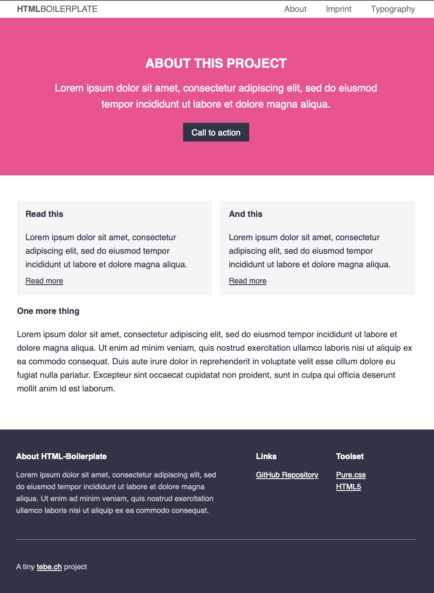

# HTML Boilerplate

This is my personal HTML boilerplate.
It is ideal for simple websites, MVPs, prototyping, or testing new ideas.

<https://tbreuss.github.io/html-boilerplate/>

## Features

- based on [Pure.css](https://purecss.io)
- ideal for up to ten pages
- responsive and mobile first
- 5ths and 24ths based grid
- horizontal-to-vertical menu with hamburger
- sticky footer

## Screenshot

## Installation

Simply download this repo and use it as a starter for whatever you're working on.

## License

Licensed under the [MIT License](https://github.com/tbreuss/html-boilerplate/blob/master/LICENSE).
